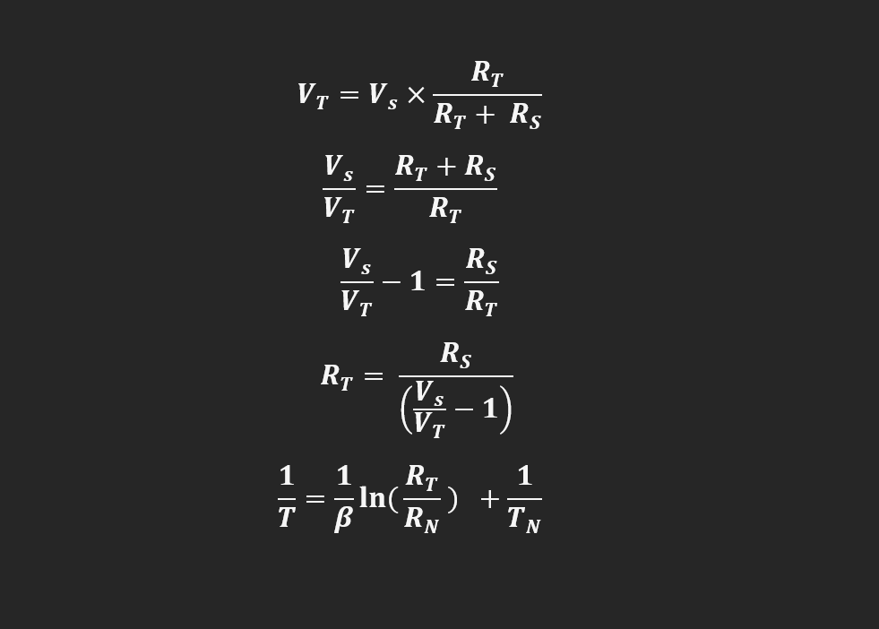
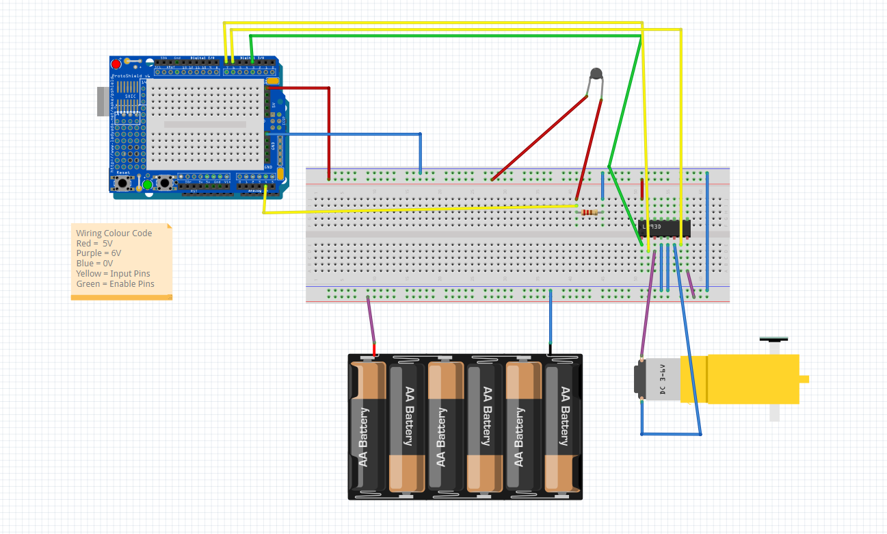

# Temperature-Controlled-Fan
This project involves using a thermistor to measure temperature; this temperature then determines whether the fan is on or off. After an arbitrary threshold temperature is reached, the fan activates automatically. 

# Introduction
In this repository, I will build on my previous thermistor project by implementing a fan that activates based on temperature. Instead of the LCD screen, the temperature was to be displayed on the Serial Monitor for debugging. The thermistor is a variable resistor whose resistance changes with temperature; it is placed in a voltage divider to produce a changing output across the thermistor. Rearranging the voltage divider formula allows the calculation of the resistance of the thermistor; this can then be used in the Steinhart-Hart Equation to calculate the temperature. The values of the beta coefficient and the nominal resistance (@ 25 degrees Celsius) were listed on the thermistor data sheet.

# Formula

Using the temperature recording from the thermistor, I can then use C++ on the Arduino IDE to control the fan. The fan requires a motor and a blade to move the air; the issue is that motors require a lot of current, which the microcontroller might not be able to supply itself. The solution is to implement a motor driver and use an external voltage source. The driver used was known as the L293D, which consists of 2 H-Bridges that allow the motor to spin forwards and backwards depending on the input logic. This project requires 9/16 pins of the H-Bridge to be used; the first pin is known as VCC1, which powers the internal circuitry, and the next pin is the enable pin, which controls the amount of power entering the motor (often by PWM, which is not necessary here). The input pins control the direction of the motor; sending A1 HIGH and A2 LOW causes the motor to go forward; sending A1 LOW and A2 HIGH causes the motor to go backwards. The output pins are connected physically to the motor; Y1 goes to the positive rail of the motor, and Y2 goes to the negative rail of the motor. VCC2 is the power source for the motor itself; this must be connected to a separate power source (6V for this project) to ensure that there is enough current. The final two pins are the ground pins; ALL grounds must be connected such that all components have a shared 0V reference. The fan is activated when the temperature reaches an arbitrary threshold value. The path is essentially from sensor detection to programming calculations to motor output.

# Wiring Diagram

# Code
[Code](

